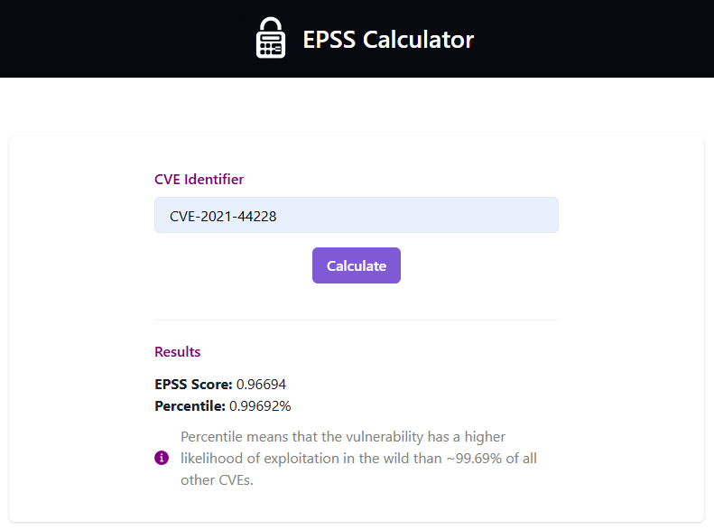

# 🔢 EPSS Calculator

The **EPSS Calculator is a user-friendly web application that calculates the EPSS** (Exploit Prediction Scoring System) **score based on a provided CVE** (Common Vulnerabilities and Exposures) identifier.

The calculator is available to use at https://theowni.github.io/EPSS-Calculator/, it doesn't send any user provided data to third party services.

**It can also be deployed locally** by [downloading](https://github.com/theowni/EPSS-Calculator/archive/refs/heads/gh-pages.zip) the `.zip` with built package and opening `index.html` using your favourite browser.

## 👾 What is EPSS?

The Exploit Prediction Scoring System (EPSS) is a data-driven effort for estimating the likelihood (probability) that a software vulnerability will be exploited in the wild.

More details about EPSS can be found on FIRST [dedicated website](https://www.first.org/epss/model).

If you're looking for a practical usage of EPSS, you might be interested in [Prioritising Vulnerabilities Remedial Actions at Scale with EPSS](https://devsec-blog.com/2024/04/prioritising-vulnerabilities-remedial-actions-at-scale-with-epss/) article.

## 🛠️ Development Stack

The project was developed with React JS. It is consisted only of client-side components and can be easily deployed locally or on the chosen server. The EPSS data are meant to be updated on a daily basis as they may change over the time.

## 🗺️ Roadmap

- [x] deploy app with basic capabilities
- [ ] add workflow for updating EPSS on a daily basis
- [ ] add more advanced calculations

## 👨‍💻 Development

In the project directory, you can run:

### `npm start`

Runs the app in the development mode.\
Open [http://localhost:3000](http://localhost:3000) to view it in your browser.

The page will reload when you make changes.\
You may also see any lint errors in the console.

### `npm run build`

Builds the app for production to the `build` folder.\
It correctly bundles React in production mode and optimizes the build for the best performance.

The build is minified and the filenames include the hashes.\
Your app is ready to be deployed!

See the section about [deployment](https://facebook.github.io/create-react-app/docs/deployment) for more information.

## 🧾 License
EPSS Calculator is proudly developed under the terms of the GNU General Public License version 3.0 (GNU GPL v3.0). This license empowers the open-source community by promoting the principles of software freedom, collaboration, and transparency. Please review the LICENSE file for a detailed overview of the rights and responsibilities associated with using and contributing to this project.

